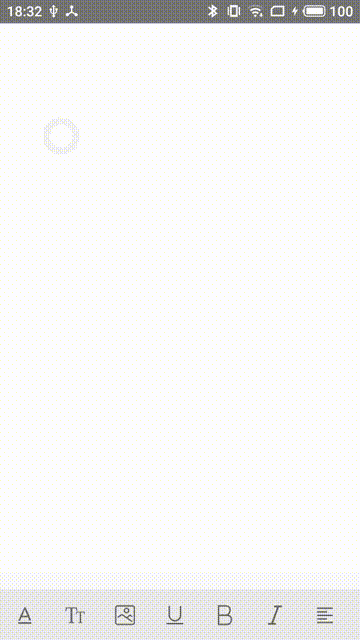

<!--
 * @Descripttion: 
 * @version: 
 * @Author: liyamei
 * @Date: 2019-11-13 18:40:00
 * @LastEditors: liyamei
 * @LastEditTime: 2019-11-14 14:42:09
 -->
# 富文本编辑器demo（react-native）

富文本编辑器demo（react-native）主要功能是字体设置（颜色、大小、下划线、加粗、斜体）、上传图片，对齐方式、标题、插入有序和无序列表等，其他功能可以根据document.execCommand参数说明自行添加。

## 项目`/src/components/richWebView/`目录下的editor.js文件中使用的document.execCommand和Document.queryCommandState()
### document.execCommand
当一个HTML文档切换到设计模式时，`document`暴露 `execCommand` 方法，该方法允许运行命令来操纵可编辑内容区域的元素。具体使用方法及参数可前往[document.execCommand详情](https://developer.mozilla.org/zh-CN/docs/Web/API/Document/execCommand)查看。

### Document.queryCommandState()
返回 指定命令 在对象内的状态码（1表示指定命令在对象内已执行；0表示指定命令在对象内未执行，处于可执行状态；-1表示指定命令在对象内处于不可用状态），详细使用方法可前往[Document.queryCommandState()详情](https://developer.mozilla.org/zh-CN/docs/Web/API/Document/queryCommandState)查看。
## 使用

### 安装依赖

```js
yarn add react-native-syan-image-picker //图片选择
yarn add react-native-webview //和h5交互
```

### 放入字体
在项目`android/app/src/main/assets/fonts`目录下放入你的字体图标，同时修改项目根目录`src/components/richWebView/`下的`RichToolbar.js`文件，修改内容如下

```js
editorIconfont: {
   fontFamily: "你的字体文件名",
    fontSize: 24
},
```
### 简单使用

```js
/*
 * @Descripttion: 使用编辑器
 * @version: 
 * @Author: liyamei
 * @Date: 2019-11-12 17:05:53
 * @LastEditors: liyamei
 * @LastEditTime: 2019-11-14 11:22:15
 */
import React from 'react';
import {
    StyleSheet,
    View,
    ScrollView
} from 'react-native';
import { actions } from '../../components/richWebView/const';
import RichEditor from '../../components/richWebView/RichEditor';
import RichToolbar from '../../components/richWebView/RichToolbar';
import ImagePicker from 'react-native-syan-image-picker';
import {STATUS_BAR_HEIGHT,ScreenHeight} from '../../assets/css/common';
const options = {
    imageCount: 1,//最大选择图片数目
    isRecordSelected: true,//记录当前已选中的图片
    isCamera: false,//是否允许用户在内部拍照
    isCrop: false,//是否允许裁剪，imageCount 为1才生效
    enableBase64: true//是否返回base64图片
};
export default class Editor extends React.Component {
    constructor(props) {
        super(props);
        this.state = {}
    }
    /**
     *
     *上传图片
     * @returns
     * @memberof Editor
     */
    _onPressAddImage() {
        return new Promise((resolve, reject) => {
            ImagePicker.asyncShowImagePicker(options)
                .then(photos => {
                    resolve(photos);
                })
                .catch(err => {
                    reject(err)
                })
        });
    }
    render() {
        return (
            <View style={styles.container}>
                <ScrollView>
                    <RichEditor
                        height={ScreenHeight-90}
                        ref={ref => this.richText = ref}
                        editorInitializedCallback={()=>{
                            this.richText.focusContentEditor();//初始化完成之后聚焦
                        }}
                    />
                </ScrollView>
                <RichToolbar
                        getEditor={() => this.richText}
                        onPressAddImage={() => this._onPressAddImage()}
                    />
            </View>
        )
    }
}
const styles = StyleSheet.create({
    container: {
        flex: 1,
    },
})
```

## 参数
### RichEditor参数
属性     | 类型|默认值     | 描述
-------- | -----| -----| -----
initialContentHTML  | PropTypes.string| ''| 初始显示的内容
height  | PropTypes.number | Dimensions.get('window').height |编辑器的高度
editorInitializedCallback  | PropTypes.func | null |编辑器初始化之后的回调函数
### RichToolbar参数
属性     | 类型|默认值     | 描述
-------- | -----| -----| -----
getEditor  | PropTypes.func.isRequired| 无| 编辑器
actions  | PropTypes.array | defaultActions数组 |操作栏数组
iconTint  |PropTypes.string | '#666'|未选中的图标颜色
selectedIconTint  | PropTypes.string| '#E64448'| 选中的图标颜色
iconMap  | PropTypes.object | 无 |图标对象
fontColorArr  | PropTypes.array| ['black', 'red', 'yellow', 'pink', 'skyblue']| 字体颜色
fontBGColorArr  | PropTypes.array| ['#fff', 'red', 'yellow', 'pink', 'skyblue']| 字体背景颜色
fontSizeArr  | PropTypes.array | [1, 2, 3, 4, 5, 6, 7] |字体大小，只能是1到7
headingArr  | PropTypes.array| ['h1','h2','h3','h4','h5']| 标题
textAlign  | PropTypes.array |[{icon:'\ue63d',type:'justifyLeft'}..] |对齐方式
toolBarBackgroundColor  | PropTypes.string | '#E9E9E9'|操作栏背景颜色
onPressAddImage  | PropTypes.func|无| 上传图片
## 效果图
</img>
